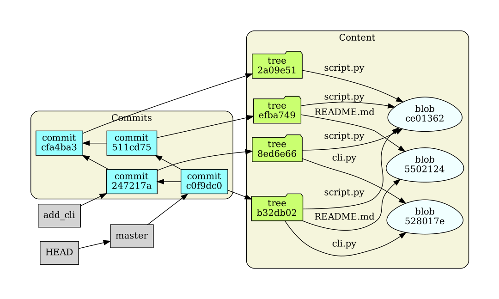
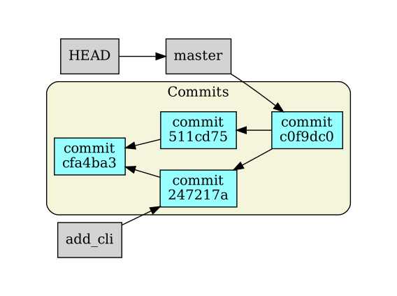

# PyGitViz
PyGitViz is a small program for visualizing the most important content of a Git
repository, primarily commits, trees, blobs and branches. The current state of
the project is a proof of concept that works, but is not particularly user
friendly. It uses [Graphviz](https://graphviz.org/) to create a PDF of the Git
repository layout, and then renders it with any PDF viewer that is available.

## Demo
I shot a short screencast with a very early version of PyGitViz, which is
available below. It both shows what the tool looks like in action, and explains
some of the basics of Git's database objects.

* [Link to screencast demo](https://www.youtube.com/watch?v=_rLuz9gzDVQ)

### PyGitViz default mode
PyGitViz has two primary modes. The default is to show HEAD, refs, commits,
blobs and trees. This is the mode demonstrated in the screencast, and is also
shown in the image below.



This is useful for exploring and demonstrating the internals of Git.

### PyGitViz hide content mode
It is also possible to hide trees and blobs with the `--hide-content` option,
which produces a view showing only HEAD, refs and commits.



This is useful for exploring and demonstrating the concept of branching,
without being overwhelmed by details of the internals.

## How to use
Install the package as instructed in the [Install section](#install), and run
PyGitViz in a terminal at the root directory of a Git project (i.e. in the same
directory where you find the `.git` repository). You can show the available
command line options by running `pygitviz -h`:

```bash
$ pygitviz -h
usage: PyGitViz [-h] [-g GIT_DIRECTORY] [--hide-content] [-p PDF_VIEWER]

Git repository visualizer for education and demonstration purposes

optional arguments:
  -h, --help            show this help message and exit
  -g GIT_DIRECTORY, --git-directory GIT_DIRECTORY
                        Path to a .git directory (default: .git)
  --hide-content        Hide trees and blobs from the representation, so only
                        commits and refs are shown. (default: False)
  -p PDF_VIEWER, --pdf-viewer PDF_VIEWER
                        Program to open the resulting PDF file with. (default:
                        xdg-open)
```

If the command cannot be found, you probably have not added the `bin` directory
in which the script was installed to your path.  You should still be able to
run PyGitViz explicitly as a Python module.

```bash
$ python3 -m pygitviz -h
# ***OUTPUT OMITTED***
```

If you're in a bash-like shell, add an `&` at the end of the command to put it
in the background.

```bash
$ pygitviz &
```
> **Important:** PyGitViz cannot handle pack files (that are created e.g. when
> you have very many loose Git objects, or when you push). PyGitViz should
> be used only with small, fresh projects.

### Selecting the PDF viewer
By default, PyGitViz will use the `xdg-open` command on Linux-based OSes,
`start` on Windows, and `open` on macOS. If you want to specify some other PDF
viewer, pass it as an argument for the `-p` option.

> **Windows note:** I find it easiest to simply associate the `.pdf` file type
> with the desired viewer, and then run with the default `start` command.

## Requirements
PyGitViz requires the following to run.

* Python 3.6 or higher
* A PDF viewer
    - The viewer should ideally refresh automatically when a PDF is updated, as
      PyGitViz will render a new PDF for each change it detects in the
      repository.
    - For Linux, I highly recommend
      [Evince](https://wiki.gnome.org/Apps/Evince), which refreshes
      automatically.
    - For macOS, the PDF Preview application that ships with the OS is used by
      default, and it kind of works, but you need to refocus on the window by
      hovering over it with your mouse cursor for it to refresh. For a smoother
      experience, I recommend [Skim](https://skim-app.sourceforge.io/).
    - For Windows, I find
      [SumatraPDF](https://github.com/sumatrapdfreader/sumatrapdf) to work
      well.
* The `dot` command line tool (part of [Graphviz](https://graphviz.org/)).

## Install
First install the requirements listed above. Then install PyGitViz directly
from this repo. If you're on a Linux-distro, or macOS, the following should
work:

```bash
$ python3 -m pip install --user git+https://github.com/slarse/pygitviz.git
```

> **Windows note:** You may need to replace `python3` with `python`.

## License
PyGitViz is under the MIT license, please see the [LICENSE](LICENSE) file for
details.
